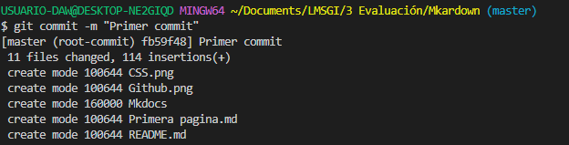

# Introducción:
Estamos ante un sitio web, donde hablamos un poco sobre al autor, sobre que es lo que estudia dia a dia y los distintos lenguajes de programación que se da en su curso.

## Recorrido 
Para llegar hasta este punto hemos hecho un proceso y eso es lo que vamos a indicar a coninuación:

1. Primera página.
   He contado un poco sobre mi, y los enlaces de mis redes socialesa principales se han puesto.

2. Segunda página.
   Se ha hablado sobre las diferentes actividades que se hace cada dia en el curso de DAW y el enlace al sitio web del instituto.

3. Tercera página.
   Hablamos de los diferentes lenguajes de programación que hemos dado en este curso 2022/2023.

Los diferentes códigos que hemos usados para pasar el markdown a github son:

 
 El **git clone** lo usamos para copiar el sitio donde vamos a poner en el github a nuestros archivos.

 

 El **git add .** añade un cambio del directorio de trabajo en el entorno de ensayo.

 

 El **commit** -m "" confirma una instantánea del directorio del entorno de ensayo en el historial de confirmaciones de los repositorios.

 

 El git **status** muestra el estado del directorio de trabajo y del área del entorno de ensayo.

 

 El git **push** carga contenido del repositorio local a un repositorio remoto.

 

    
